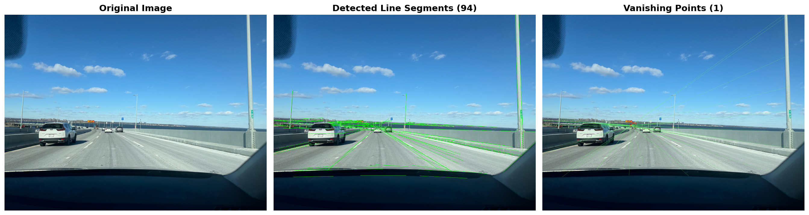
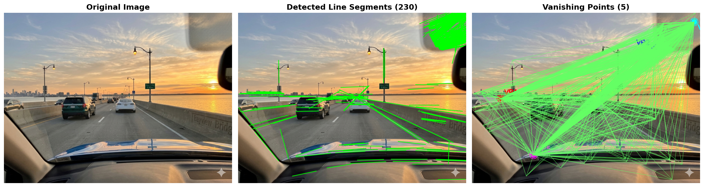

# ImageDetection - Vanishing Point Detector


**AI-powered vanishing point detection system to distinguish real photographs from AI-generated images using geometric analysis.**

## 🎯 Overview

ImageDetection analyzes images to identify vanishing points—convergence points of parallel lines that follow perspective rules. This creates a powerful signal for detecting inconsistencies between real and AI-generated images:

- **Real photographs** typically exhibit 1-2 strong, consistent vanishing points
- **AI-generated images** often show 3+ vanishing points with inconsistent geometry

### Real Photo Example


### AI-Generated Image Example  


## ✨ Features

### Core Detection Engine
- ✅ **Robust Line Detection** - Canny edge detection + Probabilistic Hough Transform
- ✅ **Intelligent Clustering** - DBSCAN with dynamic threshold scaling
- ✅ **Significance Scoring** - Filters weak/spurious vanishing points
- ✅ **Sub-pixel Accuracy** - Line segment precision for accurate VP calculation
- ✅ **Automatic Image Scaling** - Optimizes performance for large images (>1200px)

### Web Interface
- ✅ **Interactive Dashboard** - Modern, responsive web UI
- ✅ **Drag-and-Drop Upload** - Intuitive file selection
- ✅ **Real-time Preview** - Instant image preview before analysis
- ✅ **3-Panel Visualization** - Original image → detected lines → vanishing points
- ✅ **Detailed Metrics** - Lines count, VP coordinates, significance scores
- ✅ **Classification Labels** - AI vs Real assessment
- ✅ **PNG Export** - Download high-quality visualizations

### RESTful API
- ✅ **POST /api/detect** - Analyze images with JSON response
- ✅ **GET /api/visualization/{id}** - Retrieve visualization PNGs
- ✅ **GET /api/health** - Health check endpoint
- ✅ **Auto-Generated Docs** - Swagger UI at `/docs`, ReDoc at `/redoc`

## 🚀 Quick Start

### Prerequisites
- Python 3.8+
- pip or conda

### Installation

```bash
# Clone repository
git clone https://github.com/yourusername/ImageDetection.git
cd ImageDetection

# Create and activate virtual environment
python -m venv venv
source venv/bin/activate  # On Windows: venv\Scripts\activate

# Install dependencies
pip install -r requirements.txt
```

### Run the Application

#### Option 1: Using the Startup Script (Recommended)
```bash
./start_backend.sh
```

#### Option 2: Manual Startup
```bash
cd backend
python -m uvicorn app:app --host 0.0.0.0 --port 8000 --reload
```

#### Option 3: CLI Analysis Only
```bash
python test.py
```

### Access the Application

Open your browser:
```
http://localhost:8000
```

**API Documentation:** http://localhost:8000/docs

## 📊 How It Works

### Pipeline Overview

```
Input Image
    ↓
[1] Image Preprocessing
    • Convert to grayscale
    • Gaussian blur (5×5)
    • CLAHE contrast enhancement
    • Auto-scale large images
    ↓
[2] Edge & Line Detection
    • Canny edge detection (thresholds: 50, 150)
    • Probabilistic Hough Line Transform
    • Returns sub-pixel accurate line segments
    ↓
[3] Vanishing Point Clustering
    • Compute all pairwise line intersections
    • Filter invalid intersections (out-of-bounds)
    • DBSCAN clustering with dynamic threshold (2% of image size)
    • Score by cluster significance (point count)
    ↓
[4] Refinement & Classification
    • Merge nearby vanishing points
    • Filter weak VPs (<15% of strongest)
    • Classify: 0 VPs → 1 VP → 2 VPs → 3+ VPs
    ↓
[5] Visualization & Output
    • 3-subplot figure (original, lines, VPs)
    • Color-coded markers with coordinates
    • Export as high-quality PNG
    ↓
Output: Analysis results + Visualization
```

### Algorithm Details

#### 1. **Line Detection**
- **Preprocessing**: Gaussian blur + CLAHE for enhanced contrast
- **Edge Detection**: Canny (σ=1.0, thresholds: 50-150)
- **Line Extraction**: Probabilistic Hough Transform
  - Returns segments `[x1, y1, x2, y2]` (more accurate than standard Hough)
  - Parameters: minLineLength=10% of width, maxLineGap=20px

#### 2. **Intersection Computation**
- Robust parametric line intersection formula (handles parallel lines)
- Time Complexity: O(n²) for n detected lines
- Filters intersections outside extended image bounds (±200-300%)

#### 3. **DBSCAN Clustering**
- Dynamic epsilon: `max(width, height) × 0.02` (2% of largest dimension)
- min_samples: `max(3, intersections_count × 0.005)`
- Significance score = cluster size (number of intersections at that point)

#### 4. **Post-Clustering Refinement**
- Merges VPs within clustering distance using weighted averaging
- Filters VPs <15% significance of strongest (configurable)
- Limits candidates to top 5 most significant clusters

## 📈 API Examples

### Analyze Image

```bash
# Upload and analyze image
curl -X POST -F "file=@photo.jpg" http://localhost:8000/api/detect
```

**Response:**
```json
{
  "status": "success",
  "file_id": "abc123def456",
  "original_filename": "photo.jpg",
  "image_size": {
    "width": 1920,
    "height": 1440
  },
  "lines_detected": 45,
  "vanishing_points_count": 2,
  "vanishing_points": [
    {
      "id": 1,
      "x": 960.5,
      "y": 720.3,
      "significance": 18
    },
    {
      "id": 2,
      "x": 1200.2,
      "y": 650.1,
      "significance": 12
    }
  ],
  "analysis": {
    "classification": "Multi-Point Perspective",
    "description": "Clear geometric structure with two-point perspective..."
  },
  "visualization_url": "/api/visualization/abc123def456",
  "timestamp": "2024-04-18T10:30:00"
}
```

### Get Visualization

```bash
curl http://localhost:8000/api/visualization/abc123def456 > visualization.png
```

### Health Check

```bash
curl http://localhost:8000/api/health
```

## 🔍 Understanding Results

### Vanishing Point Classification

| Count | Typical Scenario | Interpretation |
|-------|------------------|-----------------|
| **0 VPs** | Natural/organic scenes | No strong geometric structure (forests, textures) |
| **1 VP** | Single perspective | Real photographs, roads, corridors - typical of reality |
| **2 VPs** | Two-point perspective | Street corners, buildings - common in architectural photos |
| **3+ VPs** | Complex/inconsistent | Potential AI artifacts, complex geometry, or unrealistic angles |

### Significance Score

- Represents the number of line intersections at that vanishing point
- **Higher values** indicate stronger, more reliable convergence
- Used to filter out weak/spurious detections
- Typically: primary VP has 2-3× higher significance than secondary VPs

### Example Interpretations

**Real Photograph (Road Scene)**
```
Lines Detected: 48
Vanishing Points: 1 (Primary: 35 intersections)
Classification: Single Perspective (Real Photo Likely)
→ Strong single vanishing point = consistent perspective ✓
```

**AI-Generated Image**
```
Lines Detected: 52
Vanishing Points: 4 (35, 18, 14, 8 intersections)
Classification: Complex/Suspicious Geometry
→ Multiple inconsistent VPs = geometric unrealism ⚠️
```

## 🛠️ Configuration & Tuning

### Key Parameters

| Parameter | Location | Purpose | Default |
|-----------|----------|---------|---------|
| `minLineLength` | `test.py:detect_lines()` | Minimum line segment length | 10% of image width |
| `maxLineGap` | `test.py:detect_lines()` | Maximum gap to merge segments | 20 pixels |
| `distance_threshold_ratio` | `test.py:find_vanishing_points()` | DBSCAN epsilon scaling | 0.02 (2%) |
| `significance_ratio` | `test.py:_refine_vanishing_points()` | Min VP strength vs strongest | 0.15 (15%) |
| `max_vps_to_consider` | `test.py:_refine_vanishing_points()` | Cap on candidate VPs | 5 |

### Tuning for Your Use Case

**For detailed/complex scenes (increase VP count):**
```python
distance_threshold_ratio=0.05  # Merge more points (less VPs)
significance_ratio=0.25         # Filter more aggressively
```

**For sparse/simple scenes (decrease VP count):**
```python
distance_threshold_ratio=0.01  # Less merging (more VPs)
significance_ratio=0.05         # Keep weak VPs
```

## 📁 Project Structure

```
ImageDetection/
├── test.py                          # Core VanishingPointDetector class (412 lines)
├── requirements.txt                 # Dependencies
├── start_backend.sh                 # Server startup script
├── QUICKSTART.md                    # Quick reference guide
├── BACKEND_SETUP.md                 # Backend setup details
├── README.md                        # This file
│
├── .github/
│   └── copilot-instructions.md      # AI coding guidelines
│
├── backend/                         # FastAPI application
│   ├── app.py                       # Main FastAPI app (195 lines)
│   ├── templates/
│   │   └── index.html              # Web dashboard
│   ├── static/
│   │   ├── style.css               # Styling (dark theme, responsive)
│   │   └── script.js               # Frontend logic (202 lines)
│   ├── uploads/                    # Image storage
│   │   └── outputs/                # Generated visualizations
│   ├── README.md                   # API documentation
│   └── .gitignore
│
├── images/                         # Test images
│   ├── generated.png               # AI-generated examples
│   ├── generated2.png
│   ├── generated3.png
│   ├── image1_real.png             # Real photo examples
│   ├── image2_real.png
│   └── camera1.jpeg
│
└── venv/                           # Python virtual environment
```

## 📊 Performance

### Analysis Speed

| Image Size | Typical Time | Performance |
|------------|-------------|-------------|
| < 500px | ~500ms | Very fast |
| 500-1200px | ~1-2 seconds | Fast |
| > 1200px | ~2-5 seconds | Auto-scaled, still fast |

*Times include: preprocessing, line detection, clustering, visualization*

### Memory Usage

- Base application: ~150-200 MB
- Per analysis request: ~50-100 MB
- Auto-cleanup after processing

## 🔧 Development

### Installation for Development

```bash
# Clone and setup
git clone https://github.com/yourusername/ImageDetection.git
cd ImageDetection
python -m venv venv
source venv/bin/activate
pip install -r requirements.txt

# Run with auto-reload
cd backend
python -m uvicorn app:app --reload
```

### Testing

```bash
# Test individual image
python test.py

# Test API endpoint
curl http://localhost:8000/api/health

# Test with sample image
curl -X POST -F "file=@images/generated2.png" \
  http://localhost:8000/api/detect | jq .
```

### Code Style

- 4-space indentation
- Descriptive variable names
- Detailed docstrings for functions
- Inline comments for non-obvious logic

## 🐛 Troubleshooting

### Port Already in Use

```bash
# Kill process on port 8000
lsof -ti:8000 | xargs kill -9

# Or use different port
cd backend
python -m uvicorn app:app --port 8001
```

### No Lines Detected

- Image may lack geometric structure (natural/organic content)
- Try increasing Canny lower threshold: `edges = cv2.Canny(enhanced, 30, 150)`
- Try reducing minLineLength parameter

### Too Many Vanishing Points

- Increase `distance_threshold_ratio` to merge nearby points
- Increase `significance_ratio` to filter weak VPs
- Try higher Canny thresholds for cleaner edges

### Module Not Found

```bash
# Ensure dependencies are installed
pip install -r requirements.txt

# Verify venv is activated
which python
```

## 📚 Documentation

- **[QUICKSTART.md](QUICKSTART.md)** - Get running in 5 minutes
- **[BACKEND_SETUP.md](BACKEND_SETUP.md)** - Detailed backend guide
- **[backend/README.md](backend/README.md)** - API documentation
- **[.github/copilot-instructions.md](.github/copilot-instructions.md)** - AI development guide
- **[http://localhost:8000/docs](http://localhost:8000/docs)** - Interactive API docs (when running)

## 🧬 Technology Stack

### Core Libraries

| Library | Version | Purpose |
|---------|---------|---------|
| **OpenCV** | 4.13.0 | Image processing, line detection |
| **NumPy** | 2.4.4 | Numerical computations, geometry math |
| **scikit-learn** | 1.8.0 | DBSCAN clustering |
| **Matplotlib** | 3.10.8 | Visualization & plotting |
| **FastAPI** | 0.104.1 | Web API framework |
| **Uvicorn** | 0.24.0 | ASGI server |

### Full Stack

- **Backend**: FastAPI + Uvicorn
- **Frontend**: Vanilla JavaScript + HTML5 + CSS3 (dark theme)
- **Image Processing**: OpenCV + NumPy + scikit-learn
- **Visualization**: Matplotlib

## 🚀 Deployment

### Using Gunicorn (Production)

```bash
pip install gunicorn
gunicorn -w 4 -k uvicorn.workers.UvicornWorker backend.app:app --bind 0.0.0.0:8000
```

### Using Docker

```dockerfile
FROM python:3.11-slim
WORKDIR /app
COPY requirements.txt .
RUN pip install -r requirements.txt
COPY . .
EXPOSE 8000
CMD ["uvicorn", "backend.app:app", "--host", "0.0.0.0", "--port", "8000"]
```

## 🎓 Use Cases

1. **AI Image Detection** - Identify AI-generated content
2. **Image Quality Assessment** - Analyze geometric consistency
3. **Photography Analysis** - Study perspective in photos
4. **Computer Vision Research** - Benchmark vanishing point detection
5. **Architectural Analysis** - Analyze building geometry
6. **Custom ML Features** - Use VP metrics for classification models

## 🔬 Research & Methodology

### Key Assumptions

- Real photographs follow perspective projection rules
- AI generators sometimes violate geometric consistency
- Vanishing point analysis captures perspective violations
- Multiple inconsistent VPs indicate potential AI artifacts

### Limitations

- Not all AI-generated images have geometric inconsistencies
- Some complex real scenes may exhibit multiple VPs
- Highly engineered AI images may pass geometric tests
- Requires sufficient geometric structure in image

### Future Improvements

- [ ] Confidence scoring combining multiple metrics
- [ ] Batch processing endpoint
- [ ] Video frame analysis
- [ ] Custom ML classifier training
- [ ] WebSocket real-time progress
- [ ] Database for result history
- [ ] Export to CSV/JSON
- [ ] Advanced filtering UI

## 📄 License

MIT License - see LICENSE file for details

## 👥 Contributing

Contributions welcome! Please:

1. Fork the repository
2. Create feature branch (`git checkout -b feature/amazing-feature`)
3. Commit changes (`git commit -m 'Add amazing feature'`)
4. Push to branch (`git push origin feature/amazing-feature`)
5. Open Pull Request

## 📞 Support

- **Issues**: GitHub Issues for bug reports
- **Discussions**: GitHub Discussions for questions
- **Documentation**: See docs/ folder

## 🙏 Acknowledgments

- OpenCV for computer vision foundation
- FastAPI for modern API framework
- scikit-learn for clustering algorithms
- All contributors and testers

## 📈 Roadmap

- **v1.1** - Batch processing, confidence scoring
- **v1.2** - Video analysis, WebSocket progress
- **v2.0** - ML classifier, advanced filters
- **v2.1** - Mobile app, cloud deployment

---

**Made with ❤️ for analyzing geometric consistency in images**

*Last Updated: April 2024*
